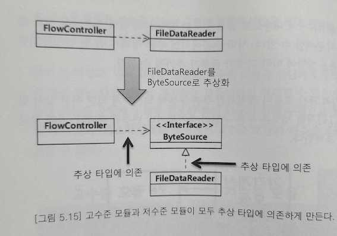
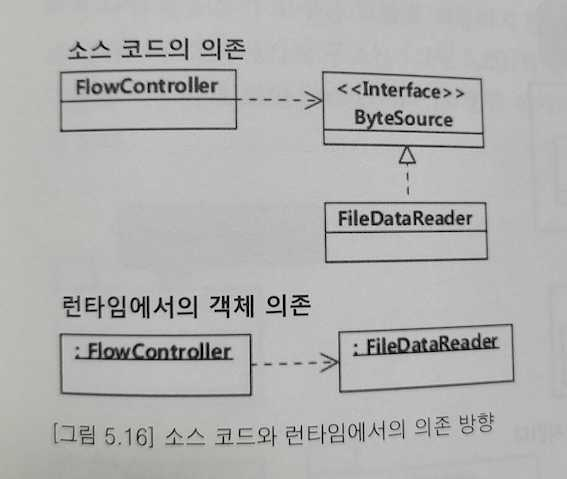
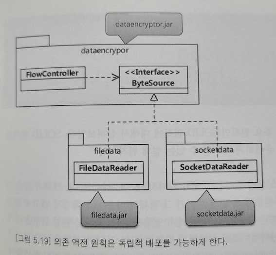

# 설계 원칙: SOLID (5/5)

## 의존 역전 원칙 (DIP, Dependency inversion principle)
> 고수준 모듈은 저수준 모듈의 구현에 의존해서는 안 된다. 저수준 모들이 고수준 모듈에서 정의한 추상 타입에 의존해야한다.
- `저수준 모듈이 고수준 모듈을 의존`하게 만든다. 
- 저수준 모듈인 각 개별 요소(즉, 상세)가 변경되더라도 고수준 모듈인 큰 틀(즉, 상위 수준)은 변경되지 않는 것
- 

### 고수준 모듈과 저수준 모듈이 모두 추상 타입에 의존하게 만든다.

### 소스 코드 의존과 런타임 의존
- 소스 코드 상에서의 의존은 역전되었지만 런타임에서의 의존은 고수준 모듈의 객체에서 저수죽 모듈의 객체로 향한다.
- 소스 코드 변경의 유연함을 확보할 수 있도록 만들어주는 원칙이지, 런타임에서의 의존을 역전시키는 것은 아니다.

### 의존 역전 원칙은 타입의 소유도 역전시키고 독립적 배포를 가능하게 한다.

