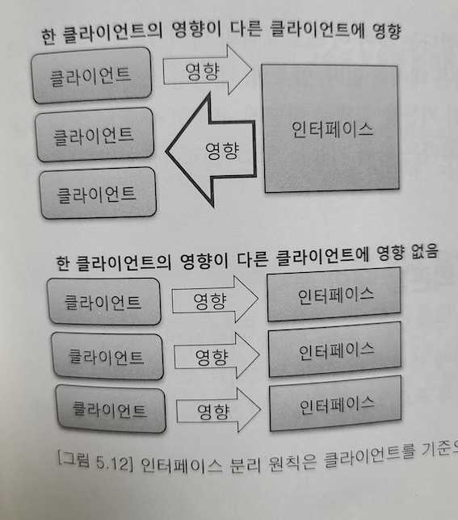

# 설계 원칙: SOLID (4/5)

## 인터페이스 분리 원칙 (ISP, Interface segregation principle)
> 인터페이스는 그 인터페이스를 사용하는 클라이언트를 기준으로 분리해야 한다.
- 자신이 사용하는 메서드에만 의존해야 한다.
- 각 클라이언트가 사용하지 않는 인터페이스에 변경이 발생하더라도 영향을 받지 않아야 한다. 
- 인터페이스 분리 원칙은 결국 `인터페이스와 콘크리트 클래스의 재사용성을 높여 주는 효과`도 갖는다.
    - 단일 책임 원칙도 마찬가지

### 인터페이스 분리 원칙은 클라이언트를 기준으로 인터페이스를 분리하는 원칙이다.
