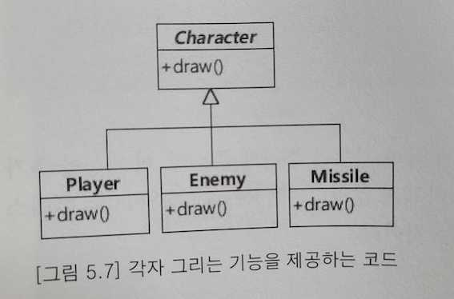

# 설계 원칙: SOLID (2/5)

## 개방-폐쇄 원칙 (OCP, Open-closed principle)
> 확장에는 열려 있어야 하고, 변경에는 닫혀 있어야 한다.
- 기능을 변경하거나 `확장할 수 있으면서` 그 기능을 사용하는 코드는 `수정하지 않는다.`
- OCP를 구현하는 방법
    1. 확장/변화되는 부분을 `추상화`한다.
    1. `다형성(상속)`을 이용한다.
- 변화가 예상하는 것을 추상화해서 `변경의 유연함`을 얻도록 해준다.
    - 변화되는 부분을 추상화하지 못하면(또는 안하면) 이 원칙을 지킬 수 없다.
    - 변화와 관련된 구현을 추상화해서 개방 폐쇄 원칙에 맞게 수정할 수 있는지 확인하는 습관을 가지자.

### 개방 폐쇄 원칙이 깨질 때의 주요 증상
- `다운 캐스팅`을 한다.
    - instanceof와 같은 타입 확인 연산자가 사용된다는 개방 폐쇄 원칙을 지키지 않을 가능성이 높다.
```java
public class drawCharacter(Character character) {
  if (character instanceof Missile) { // 타입 확인
    Missile missile = (Missile) character;  // 타입 다운 캐스팅
    missile.drawSpecific(); // 객체마다 다르게 동작할 수 있는 변화 대상이라면 알맞게 추상화 필
  } else {
    character.draw();
  }
}
```
- 비슷한 `if-else` 블록이 존재한다.
    - 게임 캐릭터 Enemy의 움직이는 경로 패턴을 추가해야 할 경우 draw() 메서드에 새로운 if 블록이 추가된다.
    - 이를 해결하려면 Enemy 클래스는 PathPattern 추상화 클래스를 사용하도록 변경한다. 
```java
// 변경 전
public class Enemy extends Character {
  private int pathPattern;
  
  public Enemy(int pathPattern) {
    this.pathPattern = pathPattern;
  }
  
  public void draw() {
    if (pathPattern == 1) {
      x += 4;
    } else if (pathPattern == 2) {
      y += 10;
    } else if (pathPattern == 4) {
      x += 4;
      y += 10;
    }
    ...; // 그려 주는 코드
  }
}
```

```java
// 변경 후
public class Enemy extends Character {
  private PathPattern pathPattern;
  
  public Enemy(PathPattern pathPattern) {
    this.pathPattern = pathPattern;
  }
  
  public void draw() {
    int x = pathPattern.nextX();
    int y = pathPattern.nextY();
    ...; // 그려 주는 코드
  }
}
```

### 각자 그리는 기능을 제공하는 코드


### 이동 경로 계산에 개방 폐쇄 원칙을 적용한 결과
