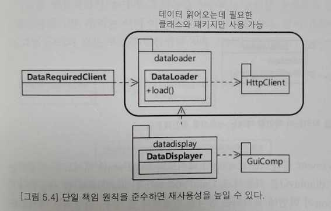

# 설계 원칙: SOLID (1/5)

## 단일 책임 원칙 (SRP, Single responsibility principle)
> 클래스는 단 한 개의 책임을 가져야 한다.
- 클래스가 한 개의 이유로만 변경되려면 `한 개의 책임`만을 가져야 한다.
- 이것이 잘 지켜지지 않으면 다른 원칙들도 그 효과가 반감되기 때문에 `최대한 지켜야하는 원칙`
- `책임이란 변화에 대한 것`
- 이 원칙을 잘 지키는지 확인하려면 메서드를 실행하는 것이 누구인지 확인해보는 것
- 클래스의 사용자들이 서로 다른 메서드들을 사용한다면 그들 메서드는 각각 다른 책임에 속할 가능성이 높고, 따라서 책임 분리 후보가 될 수 있다.

### 책임을 분리하면 변경의 여파를 줄일 수 있다.

### 단일 책임 원칙을 준수하면 재사용성을 높일 수 있다.

### 단일 책임 원칙을 지키는지 확인할 때에는 사용자를 확인해본다.
