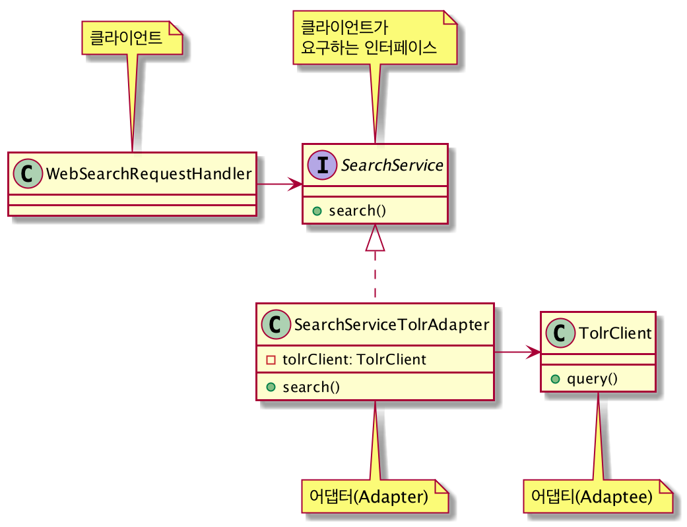
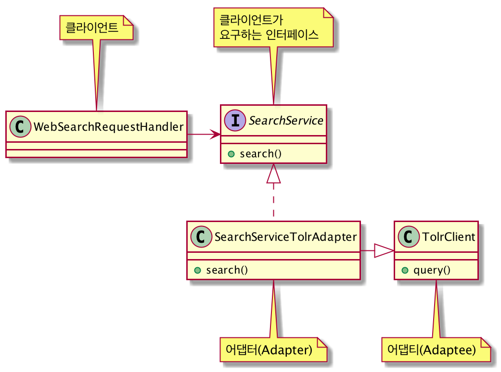

# 어댑터(Adapter) 패턴
: 클래스, 객체 구조

## 의도
- 클래스의 인터페이스를 사용자가 기대하는 인터페이스 형태로 적응(변환)시킨다.
- 서로 일치하지 않는 인터페이스를 갖는 클래스들을 함께 동작시킨다.
- 개방 폐쇄 원칙을 따를 수 있도록 도와준다.

## 다른 이름
- 래퍼(Wrapper)

## 활용성
- 기존 클래스를 사용하고 싶은데 인터페이스가 맞지 않을 때
- 이미 만든 것을 재사용하고자 하나 이 재사용 가능한 라이브러리를 수정할 수 없을 때
- 서브 클래스가 많고 인터페이스를 개조한다는 것이 현실정이 없을 때 객체 어댑터를 써서 부모 클래스의 인터페이스 변경

## 객체 어댑터(Object Adapter) 패턴을 적용한 구조
- 객체 합성(조립)을 이용한 어댑터 구현

## 클래스 어댑터(Class Adapter) 패턴을 적용한 구조
- 상속을 이용한 어댑터 구현

## 잘 알려진 사용예
- SLF4J는 동일 API로 여러 로깅 프레임워크를 사용할 수 있도록 어댑터 패턴을 사용하고 있다.
    - interface slf4j <|.. slf4j-log4j ..> log4j
    - interface slf4j <|.. slf4j-jdk14 ..> java.util.logging
