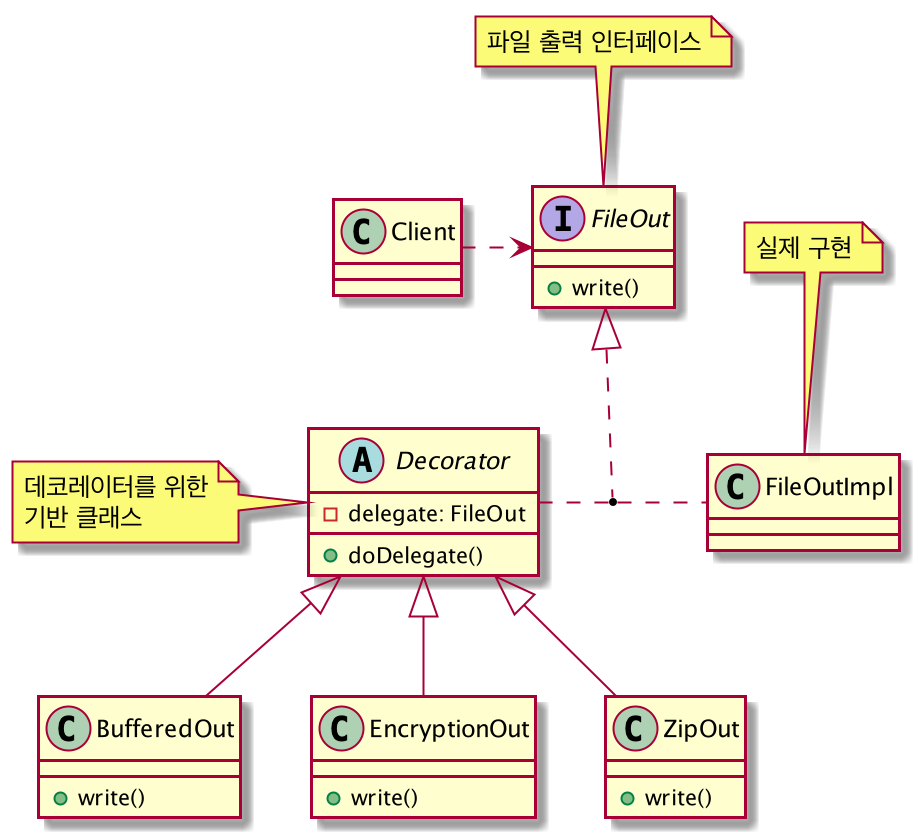

# 데코레이터(Decorator) 패턴
: 객체 구조

## 의도
- 객체에 동적으로 새로운 책임을 추가할 수 있게 한다.
- 기능을 추가하려면, 서브클래스는 생성하는 것보다 융통성 있는 방법을 제공한다.

## 다른 이름
- 래퍼(Wrapper)

## 활용성
- 동적으로 또한 투명하게, 다시 말해 다른 객체에 영향을 주지 않고 개개의 객체에 새로운 책임을 추가하기 위해 사용
- 제거될 수 있는 책임에 대해 사용
- 실제 상속으로 서브클래스를 계속 만드는 방법이 실질적이지 못할 때

## 이익
- 단순한 상속보다 설계의 융통성을 더 많이 증대시킬 수 있다.
- 클래스 계통의 상부측 클래스에 많은 기능이 누적되는 상황을 피할 수 있다.

## 부담
- 장식자와 해당 그 장식자의 구성요소가 동일한 것은 아니다.
- 장식자를 사용함으로써 작은 규모의 객체들이 많이 생긴다.

## 구현 시 고려할 사항
- 인터페이스 일치시키기
- 추상 클래스로 정의되는 Decorator 클래스 생략하기
- Component 클래스는 가벼운 무게를 유지하기
- 객체의 겉포장을 변경할 것인가, 속을 변경할 것인가

## 관련 패턴
- 일종의 어댑터 패턴, 어댑터 패턴은 인터페이스를 변경시켜주는 것이지만 데코레이터 패턴은 객체의 책임, 행동을 변화시킨다.
- 데코레이터는 한 구성요소만을 갖는 컴퍼지트로 볼 수 있다. 그러나 이 목적은 객체의 합성이 아니라 객체에 새로운 행동을 추가하기 위한 것
- 데코레이터는 객체의 겉모양을 변경하고 전략 패턴은 객체의 내부를 변화시킨다.
    - 객체를 변경하는 두 가지 다른 대안인 셈
    
### 데코레이터 패턴을 적용한 구조
- 상속이 아닌 위임을 하는 방식으로 기능을 확장해 나간다.
