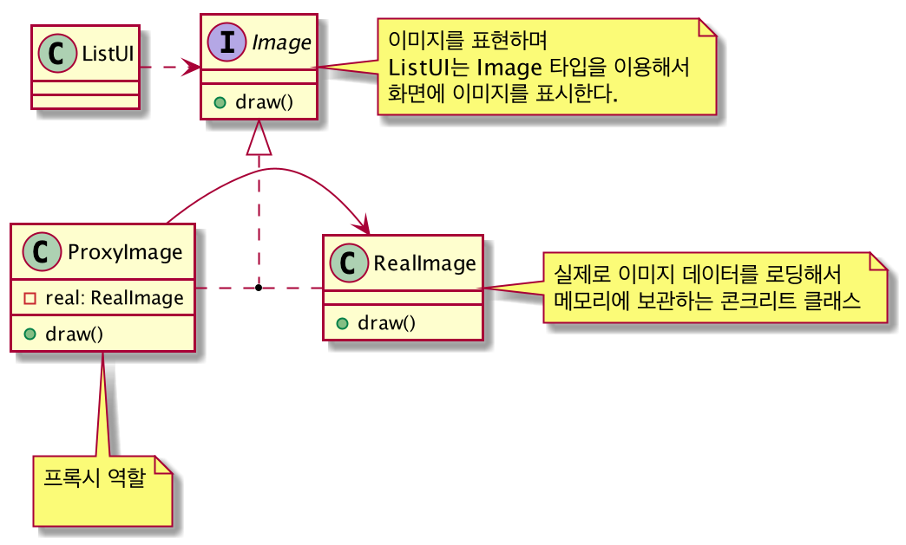
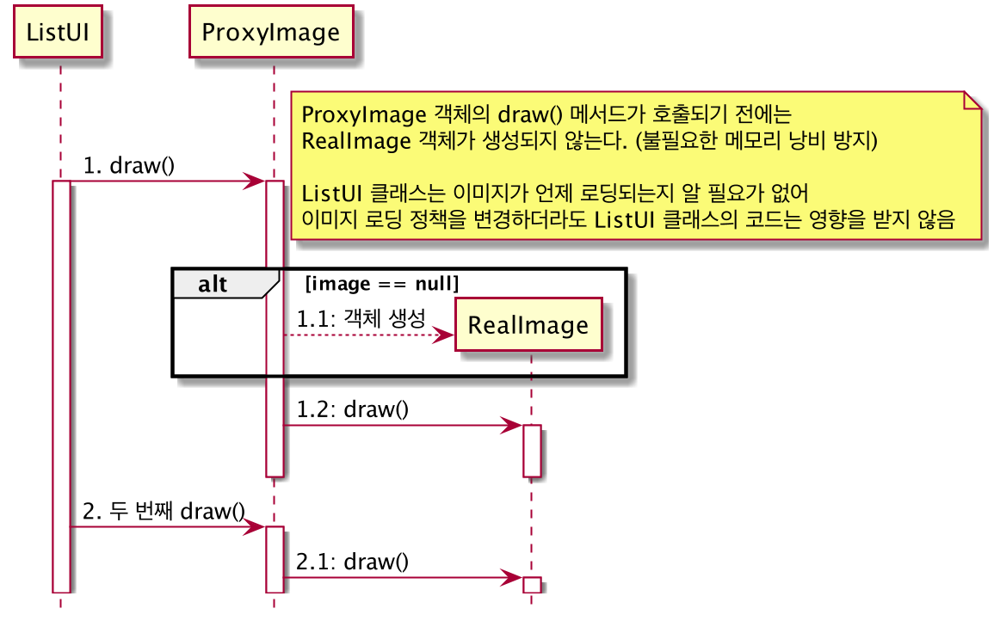

# 프록시(Proxy) 패턴
: 객체 구조

## 의도
- 다른 객체에 대한 접근을 제어하기 위한 대리자 또는 자리채움자 역할을 하는 객체를 둔다.

## 다른 이름
- 대리자(Surrogate)

## 활용성
- 단순한 포인터보다는 조검 더 다방면에 활용할 수 있거나 정교한 객체 참조자가 필요한 때 적용할 수 있다.
- 원격지 프록시(remote proxy)는 서로 다른 주소 공간에 존재하는 객체를 가리키는 대표 객체로, 로컬 환경에 위치
- 가상 프록시(virtual proxy)는 요청이 있을 때만 필요한 고비용 객체를 생성
- 보호용 프록시(protection proxy)는 원래 객체에 대한 실제 접근을 제어
- 스마트 참조자(smart reference)는 원시 포인터의 대체용 객체로, 실제 객체에 접근이 일어날 때 추가적인 행동을 수행

## 협력 방법
- 프록시 클래스는 자신이 받은 요청을 RealSubject 객체에 전달합니다.

## 결과
- 원격지 프록시는 객체가 다른 주소 공간에 존재한다는 사실을 숨길 수 있다.
- 가상 프록시는 요구에 따라 객체를 생성하는 등 처리를 최적화할 수 있다.
- 보호용 프록시 및 스마트 참조자는 객체가 접근할 때마다 추가 관리를 책임진다.

## 프록시 패턴을 적용할 때 고려할 점
- 가상 프록시는 필요한 순간에 실제 객체를 생성하는 경우가 많다.
- 접근 제어를 위한 목적으로 사용되는 보호 프록시는 보호 프록시 객체를 생성할 때 실제 객체를 전달
    - 실제 객체의 타입을 알 필요 없이 추상 타입을 사용하면 됨
- 위임 방식이 아닌 상속을 사용해서 프록시를 구현할 수도 있다.
    - 구조가 단순해서 구현이 비교적 쉽다.
    - 상속 방식은 객체를 생성하는 순간 실제 객체가 생성되기 때문에 가상 프록시를 구현하기에는 적합하지 않다.

## 구현 시 고려할 사항
- 인터페이스 일치시키기
- 추상 클래스로 정의되는 Decorator 클래스 생략하기
- Component 클래스는 가벼운 무게를 유지하기
- 객체의 겉포장을 변경할 것인가, 속을 변경할 것인가

## 관련 패턴
- 일종의 어댑터 패턴, 어댑터 패턴은 인터페이스를 변경시켜주는 것이지만 데코레이터 패턴은 객체의 책임, 행동을 변화시킨다.
- 데코레이터는 한 구성요소만을 갖는 컴퍼지트로 볼 수 있다. 그러나 이 목적은 객체의 합성이 아니라 객체에 새로운 행동을 추가하기 위한 것
- 데코레이터는 객체의 겉모양을 변경하고 전략 패턴은 객체의 내부를 변화시킨다.
    - 객체를 변경하는 두 가지 다른 대안인 셈
    
## 프록시 패턴을 적용한 구조

## 위 구조의 flow
