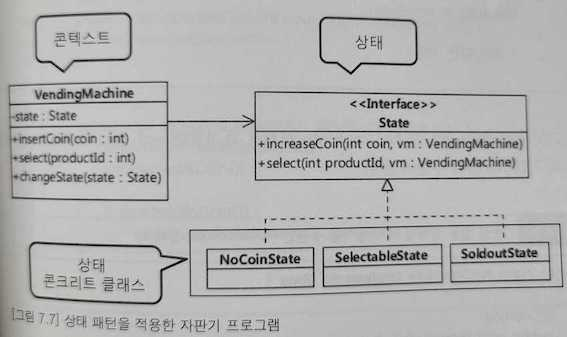
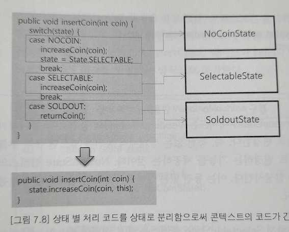

# 상태(State) 패턴
: 객체 행동

## 의도
- 객체의 내부 상태에 따라 스스로 행동을 변경할 수 있게 허가하는 패턴
- 객체는 마치 자신의 클래스를 바꾸는 것처럼 보인다.

## 다른 이름
- 상태 표현 객체(Object for state)

## 활용성
- 객체의 행동이 상태에 따라 달라질 수 있고, 객체의 상태에 따라서 런타임에 행동이 바뀌어야 할 때
- 어떤 연산에 그 객체의 상태에 따라 달라지는 다중 분기 조건 처리가 너무 많이 들어있을 때

## 관련 패턴
- 상태 객체의 공유 시점과 공유 방법을 정의하는 데에 플라이급 패턴을 이용한다.
- 상태 객체는 종종 하나만 존재할 때가 많은데, 이때는 단일체이다.

## 상태 변경은 누가?
- 상태 변경을 하는 주체는 콘텍스트나 상태 객체 둘 중 하나가 되고 주어진 상황에 알맞게 정해준다.
- 콘텍스트에서 상태를 변경하는 방식은 비교적 상태 개수가 적고 상태 변경 규칙이 거의 바뀌지 않는 경우에 유리
    - 상태 변경 처리 코드가 복잡해질수록 상태 변경의 유연함이 떨어지게된다.
- 상태 객체에서 콘텍스트의 상태를 변경할 경우, 콘텍스트에 영향을 주지 않으면서 상태를 추가하거나 상태 변경 규칙을 바꿀 수 있게 된다.
    - 상태 구현 클래스가 많아질수록 분산되어 파악이 힘들다.
    - 한 상태 클래스에서 다른 상태 클래스에 대한 의존도 발생한다.

### 상태 패턴을 적용한 자판기 프로그램

### 상태 별 처리 코드를 상태로 분리함으로써 Context의 코드가 간결해지고 변경의 유연함을 얻게 된다. 
