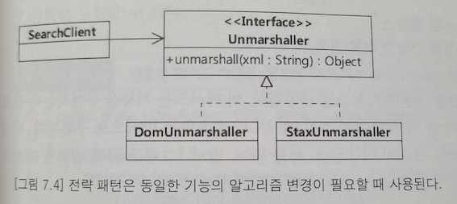

# 전략(Strategy) 패턴
: 객체 행동

## 의도
- 동일 계열의 알고리즘군을 정의하고, 각 알고리즘을 캡슐화하며, 이들을 상호교환이 가능하도록 만든다.
- 알고리즘을 사용하는 클라이언트와 상관없이 독립적으로 알고리즘을 다양하게 변경할 수 있게 한다.

## 다른 이름
- 정책(Policy)

## 활용성
- 행동들이 조금씩 다를 뿐 개념적으로 관련된 많은 클래스들이 존재할 때
- 알고리즘의 변형이 필요한 경우 이러한 변형물들이 알고리즘의 상속 관계로 구현될 때
- 사용자가 몰라야 하는 데이터를 사용하는 알고리즘이 있을 때
- 하나의 클래스가 많은 행동을 정의하고, 이런 행동들이 그 클래스의 연산 안에서 복잡한 다중 조건문의 모습을 취할 때

## 장점
- 동일 계열의 관련 알고리즘군이 생긴다.
- 서브클래싱을 사용하지 않는 대안이다.
- 조건문을 없앨 수 있다.
- 구현의 선택이 가능하다.

## 단점
- 사용자(프로그램)는 서로 다른 전략을 알아야 한다.
- Strategy 객체와 Context 객체 사이에 소통 오버헤드가 있다.
- 객체 수가 증가한다.

## 관련 패턴
- 전략 객체는 규모가 작은 클래스들이므로 플라이급 패턴으로 정의하는 것이 좋다.

### 전략 패턴을 적용한 요금 계산기 설계

### 콘텍스트의 클라이언트가 전략의 상세 구현을 알게 됨

### 비슷한 코드를 실행하는 if-else 블록은 전략 패턴 적용 대상이다.

### 전략 패턴은 동일한 기능의 알고리즘 변경이 필요할 때 사용된다.

