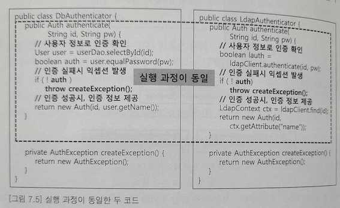

# 템플릿 메서드(Template Method) 패턴
: 클래스 행동

## 의도
- 객체의 연산에는 알고리즘의 뼈대만을 정의하고 각 단계에서 수행할 구체적 처리는 서브클래스 쪽으로 미룬다.
- 알고리즘의 구조 자체는 그대로 놔둔 채 알고리즘 각 단계 처리를 서브클래스에서 재정의할 수 있게 한다.
- 코드 재사용을 위한 기본 기술이고 특히 클래스 라이브러리 구현 시 중요한 기술인데, 이는 라이브러리에 정의할 클래스들의 공통 부분을 분리하는 수단이기 때문이다.
- 부모 클래스는 서브클래스에 정의된 연산을 호출할 수 있지만 반대 방향의 호출은 안된다.

## 헐리우드 원칙(Hollywood principle)
> 먼저 연락하지 마세요. 저희가 연락 드리겠습니다.
- 의존성 부패를 방지하도록 역전된 제어구조를 가지는 원칙
- 템플릿 메서드는 헐리우드 원칙이라는 역전된 제어구조를 끌어낸다.
- 헐리우드 원칙은 저수준 구성요소들을 다양하게 사용할 수 있으면서도, 다른 클래스가 그런한 구성요소에 너무 의존하지 않게 만들어주는 기법인 반면, DIP는 추상화에 의존한다는 개념이라 좀더 강하고 일반적인 내용을 담고 있다.

## 템플릿 메서드는 여러 종류의 연산 중 하나를 호출한다.
- 구체 연산(concrete operation): 콘크리트 클래스나 사용자 클래스에 정의된 연산
- Abstract Class 구체 연산: 서브클래스에서 일반적으로 유용한 연산
- 기본 연산: 추상화된 연산 (꼭 오버라이드를 해야하는지)
- 팩토리 메서드
- 훅 연산(hook operation): 필요하다면 서브클래스에서 확장할 수 있는 기본 행동을 제공하는 연산. 기본적으로는 아무 내용도 정의하지 않는다.(오버라이드가 가능한지)
    - 훅(hook) 메서드: 상위 클래스에서 실행 시점이 제어되고, 기본 구현을 제공하면서, 하위 클래스에서 알맞게 확장할 수 있는 메서드

## 관련 패턴
- 팩토리 메서드 패턴은 종종 템플릿 메서드 패턴이라고도 한다.
- 상속을 이용하여 다양한 알고리즘을 만들어 낸다.
- 전략 패턴과 관계가 있으며, 각 전략들은 위임을 통하여 전체 알고리즘을 다양화한다.

## 잘 알려진 사용예
- AbstractMap 추상클래스를 상속받은 HashMap, TreeMap의 get()이 훅 메서드이다.

### 실행 과정이 동일한 두 코드
